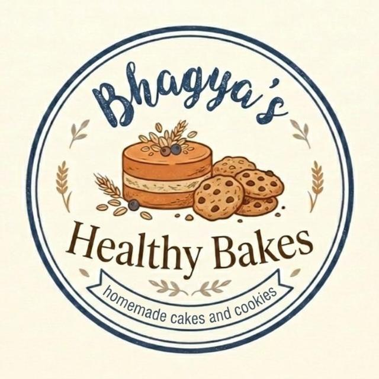

# 🍰 Bhagya's Healthy Bakes

<p align="center">
  
</p>

<p align="center">
  <b>Guilt-Free, Organic, Homemade Cakes & Cookies</b><br/>
  <i>No Sugar • No Maida • No Preservatives • No Dalda</i>
</p>

---

## 🌟 Overview

**Bhagya's Healthy Bakes** is a modern, high-performance food delivery & e-commerce platform built for health-conscious food lovers. Featuring artisanal baked goods made purely from whole wheat, organic jaggery, and pure desi ghee, the application provides a smooth Amazon/Flipkart-style shopping experience with dynamic UPI QR payment generation and direct WhatsApp order dispatching.

---

## ✨ Key Highlights & Features

### 🛒 Customer Storefront
* **🌾 Health Guarantees Top Bar**: Prominently displays *No Sugar • No Maida • No Preservatives • No Dalda*.
* **🎨 Immersive Navy & Vanilla Theme**: Curated palette derived from the official logo (Deep Navy `#1E3A5F`, Warm Biscuit `#D99036`, Vanilla Cream `#FAF5EE`).
* **🔵 Full Pill Rounded UI**: Modern rounded pill buttons (`rounded-full`) across all interactive cards & navigation elements.
* **🎠 Dynamic Hero Banner**: Interactive promotional carousel showcasing seasonal specials and fresh bakes.
* **↔️ Horizontal Scroll Product Showcase**: Smooth swipeable rows for **Top Products**, **Guilt-Free Cookies**, and **Healthy Cakes**.
* **📦 Amazon / Flipkart Style Product Pages**: Multi-angle image preview, weight variants (250g, 500g, 1kg), ingredient transparency, and customer reviews.

### 💳 Payment & Order Routing
* **📲 Dynamic UPI QR Payment**: Automatic generation of payment QR codes with exact order total for scanning via GPay, PhonePe, Paytm, and BHIM.
* **💬 WhatsApp Order Routing**: Instant pre-formatted order summary generation redirected directly to seller WhatsApp.

### ⚙️ Admin Control Panel (`/admin`)
* **📊 Metrics Dashboard**: Real-time sales summary and order metrics.
* **📦 Order Management**: Filterable order table with status workflow (Received, Preparing, Dispatched, Delivered).
* **🏙️ Multi-Branch Management**: Internal branch allocation between **Vizag (Main Branch)** and **Attapur (Hyderabad Branch)**.
* **🖼️ Banner & Category Controls**: Add, edit, and reorganize hero slides and store categories dynamically.

---

## 🛠️ Technology Stack

* **Framework**: Next.js 16 (App Router)
* **Library**: React 19, TypeScript
* **Styling**: Tailwind CSS v4, Framer Motion
* **Icons**: Lucide React
* **Database & ORM**: SQLite / PostgreSQL with Prisma
* **Containerization**: Docker & Docker Compose

---

## 🚀 Getting Started

### Prerequisites
* Node.js 20+
* npm or pnpm

### Installation

```bash
# Clone the repository
git clone https://github.com/Aswinsaipalakonda/GharChef.git
cd GharChef

# Install dependencies
npm install

# Run dev server
npm run dev
```

Open [http://localhost:3000](http://localhost:3000) in your browser.

---

## 🐳 Docker Deployment

```bash
# Build and run multi-container environment
docker compose up --build
```

---

<p align="center">
  Developed with ❤️ for <b>Bhagya's Healthy Bakes</b>
</p>
